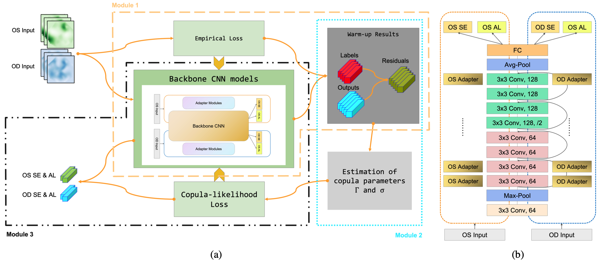

<div align="center">

# OUCopula: Bi-Channel Multi-Label Copula-Enhanced Adapter-Based CNN for Myopia Screening Based on OU-UWF Images

[](https://doi.org/10.48550/arXiv.2403.11974) [](https://doi.org/10.48550/arXiv.2403.11974)


</div>

The code for paper " OUCopula: Bi-Channel Multi-Label Copula-Enhanced Adapter-Based CNN for Myopia Screening Based on OU-UWF Images (IJCAI 2024 Accepted)’’.



Three modules in OUCopula framework are illustrated in figure (a):
1. a warm-up module that trains the backbone under empirical losses,
2. a copula estimation module estimates the parameters $\sigma_{jk}$ and $\gamma_{j_1k_1, j_2k_2}$ in the Gaussian copula based on the results of module 1,
3. an OUCopula module that trains the backbone CNN using the derived copula-likelihood loss.

The detailed architecture of backbone ResNet with adapter modules is shown in figure (b).

## Requirement
#### Hardware
OUCopula requires only a standard computer with enough RAM and a NVIDIA GPU to support operations. We use the following specs:

    CPU: 16 vCPU Intel(R) Xeon(R) Platinum 8352V CPU @ 2.10GHz/core
    RAM: 90GB
    GPU: NVIDIA RTX 4090(24GB)

#### Python package
    python        == 3.8.10
    pandas        == 2.0.3
    numpy         == 1.24.2
    aioitertools  == 0.11.0
    scikit-learn  == 1.3.2
    torch         == 2.0.9+cu118
    seaborn       == 0.13.0

## Data
The UWF fundus images are in JPEG format and compressed to a resolution of 224 x 224 pixels to facilitate subsequent analysis.

The OU UWF fundus images dataset is temporary not available for public access and undergoing a rigorous ethical review process for open sourcing. Once we are authorized, we will make it publicly available.

## How to train and use
The training process of OUCopula including three modules: 
#### 1. a warm-up module with adapter modules that trains the backbone CNN under empirical losses
The training command for module 1 is:

```bash 
python code/warmup_adapter seed0.ipynb
```

The best model with lowest validation loss is stored in `./root/autodl-tmp/warmup loader files/WorkID{work_id}_Simu_Warmup_seed{seed}_fold{fold}_X_length{X_length}_batchsize{batch_size}_num_epoch{num_epochs}.pth` 
and the performance of the best model on test dataset is stored in `./Simu/WorkID{work_id}_Simu_Warmup_seed{seed}_X_length{X_length}_batchsize{batch_size}_num_epoch{num_epochs}.csv`.

#### 2. a copula estimation module that estimates the parameters in the Gaussian copula based on the results of the warm-up module; 
#### 3. an OUCopula module that trains the backbone CNN using the derived copula-likelihood loss that can efficiently capture the dependence structure across multiple labels through a Gaussian copula model.
The training command for module 2 and 3 is:

```bash
python code/copula_adapter seed0.ipynb
```

The best model obtained from module 1 is loaded as the pretrained model. The optimal model under copula loss is saved in the `/root/autodl-tmp/warmup loader files/WorkID{work_id}_COPULA_seed{seed}_fold{fold}_X_length{X_length}_batchsize{batch_size}_num_epoch{num_epochs}.pth` and its performance on the test dataset is saved in the `./Simu/WorkID{work_id}_COPULA_seed{seed}_X_length{X_length}_batchsize{batch_size}_num_epoch{num_epochs}.csv`.

## Disclaimer: 
This code is for research purposes and is not approved for clinical use.

## Citation
If you find the codebase useful for your research, please cite our paper:
*The formal conference bibtex will be provided once it becomes available.*
```
@inproceedings{OUCopula_IJCAI2024,
  title     = {OUCopula: Bi-Channel Multi-Label Copula-Enhanced Adapter-Based CNN for Myopia Screening Based on OU-UWF Images},
  author    = {Yang Li, Qiuyi Huang, Chong Zhong, Danjuan Yang, Meiyan Li, A.H. Welsh, Aiyi Liu, Bo Fu, Catherien C. Liu, Xingtao Zhou},
  year      = {2024},
  url       = {https://arxiv.org/abs/2403.11974},
  doi       = {10.48550/arXiv.2403.11974}
}
```
<!--   booktitle = {Proceedings of the Thirty-Second International Joint Conference on
               Artificial Intelligence, {IJCAI-23}},
  publisher = {International Joint Conferences on Artificial Intelligence Organization},
  editor    = {Edith Elkind},
  pages     = {4984--4992},
  month     = {8},
  note      = {Main Track},
  doi       = {10.24963/ijcai.2023/554}, -->


## Contact
If you have any questions, please contact us via email:
* [Yang Li](18110980006@fudan.edu.cn)
* [Qiuyi Huang](charley.huang@connect.polyu.hk)
* [Chong Zhong](chzhong@polyu.edu.hk)